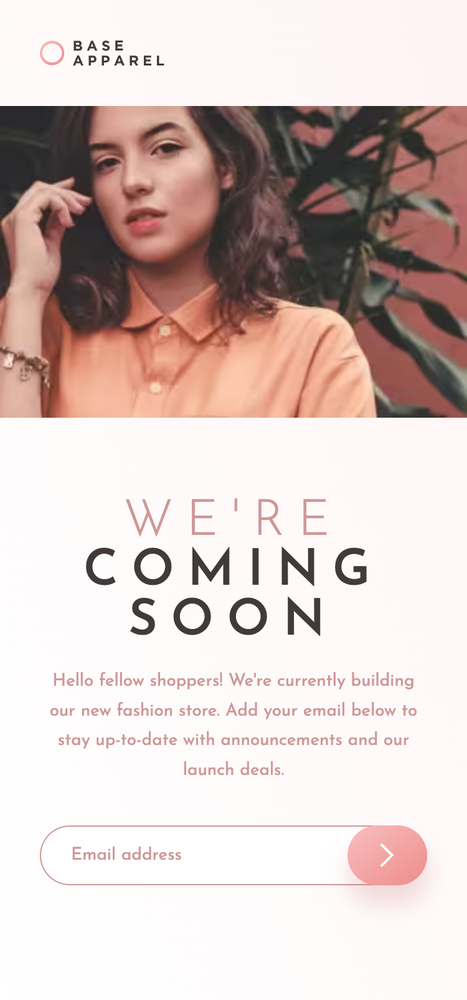

# Frontend Mentor - Base Apparel coming soon page solution

## Welcome! 👋

# Frontend Mentor - Base Apparel coming soon page solution

This is a solution to the [Base Apparel coming soon page challenge on Frontend Mentor](https://www.frontendmentor.io/challenges/base-apparel-coming-soon-page-5d46b47f8db8a7063f9331a0). Frontend Mentor challenges help you improve your coding skills by building realistic projects. 

### The challenge

Users should be able to:

- View the optimal layout for the site depending on their device's screen size
- See hover states for all interactive elements on the page
- Receive an error message when the `form` is submitted if:
  - The `input` field is empty
  - The email address is not formatted correctly

## Live site

🚀 [https://waquintero-ia.github.io/baseApparel/]()

## Solution URL
🚀 [https://www.frontendmentor.io/solutions/base-apparel-react-tailwind-c_oZYShPG5]()

## Author

- Frontend Mentor - [@waquintero-ia](https://www.frontendmentor.io/profile/yourusername)

### Screenshot

Desktop

Mobile

